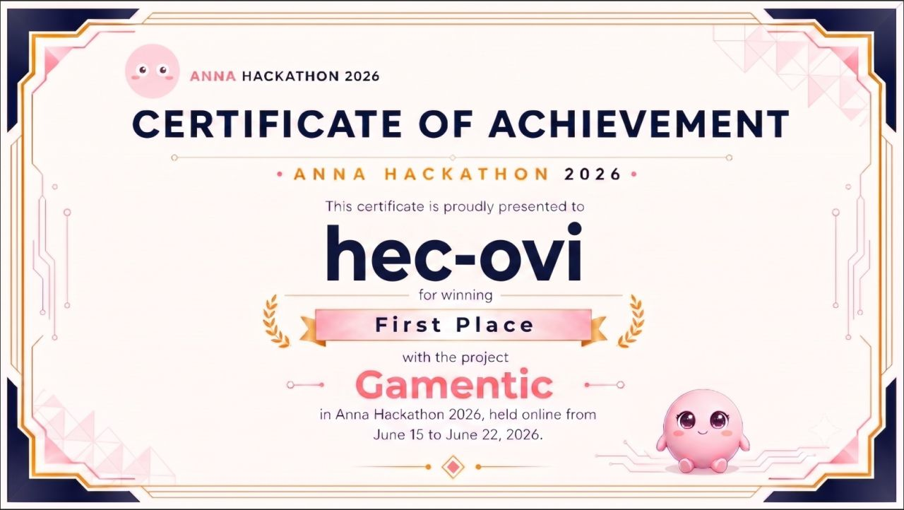

<h1 align="center">Hector Oviedo</h1>

<h3 align="center">Applied AI Engineer</h3>

<em>Agentic engineering</em>

  
  

AI engineer focused on innovation, and a generalist on purpose: I can put AI to work wherever it fits. Multi-agent engines, MCP servers and clients, skills and tooling for coding agents, and local agents optimized for whatever hardware the project actually runs on. Everything ships production-ready: Docker, compose, DevOps included. Last role: Senior AI Solutions Architect at Ohara, building the tool and MCP integration layer of Modu, an agent that generated full apps. Remote, from Rosario, Argentina.

🏆 <strong>1st place, Anna AI-Native App Hackathon 2026</strong>, with <a href="https://github.com/hec-ovi/gamentic">gamentic</a>: my multi-agent dungeon RPG, ported to run natively on the Anna platform in one week (<a href="https://github.com/hec-ovi/gamentic-anna">port repo</a>).

---

<h2 align="center">Agents and agentic loops</h2>

Systems where an LLM runs a loop with real responsibilities: tools, state, memory, recovery.

| Repo | What it is |
|---|---|
| [**Censurado**](https://elcensuradoweb.com) | Self-hosted AI news portal run end to end by an agent harness, live at [elcensuradoweb.com](https://elcensuradoweb.com). A stdlib Python brain the agent drives through tool calls, with a gated editorial walk and a 24/7 serve loop with a multi-agent fallback chain (Gemini, Codex, Claude, local model).    |
| [gamentic](https://github.com/hec-ovi/gamentic) | The hackathon winner above, fully local: state-machine engine, every character its own agent with bounded memory, 40 validated tools, swappable text/image/voice layers. 850+ tests. |
| [noob-cli](https://github.com/hec-ovi/noob-cli) | Compact Rust agent CLI for local OpenAI-compatible models: Docker isolation, sessions, skills, MCP, plan mode, sub-agents, web search. 673 tests, release binary under 4 MB. |
| [open-research](https://github.com/hec-ovi/open-research) | Deep-research pipeline: Planner / Finder / Summarizer / Reviewer / Writer agents, SSE telemetry, durable sessions, PDF and Markdown exports. |
| [rebel-forge](https://github.com/hec-ovi/rebel-forge) | Autonomous social-media agent: 11-tool loop with error recovery, per-platform voice memory, publishes to five networks from one prompt. |

<h2 align="center">Skills, tools, agentic toolkits & MCPs</h2>

The layer that makes agents useful anywhere: skills they install themselves, tools they can trust, MCP surfaces that plug them into anything.

| Repo | What it is |
|---|---|
| [telegram-bot-skill](https://github.com/hec-ovi/telegram-bot-skill) | Any local CLI coding agent (Claude Code, opencode, Codex, Gemini) as a private Telegram bot. One repo, three surfaces: installable skill, npm toolkit, MCP server over stdio or Streamable HTTP. Zero-dependency Node core, deterministic access tiers, 87 tests. |
| [agentickit](https://github.com/hec-ovi/agentickit) | React copilot framework on AG-UI: reads app state, fills forms, confirms destructive actions, calls your tools, `.pilot/` markdown skills. 579 tests, on npm. |
| [websearch-skill](https://github.com/hec-ovi/websearch-skill) | Keyless multi-engine web search and page reading for agents: rank fusion, clean Markdown extraction, fetched content fenced as untrusted. PyPI and MCP Registry. |
| [research-skill](https://github.com/hec-ovi/research-skill) | Persistent project-scoped knowledge base for SKILL.md agents: progressive disclosure, contrarian-pass investigation, survives context compaction. |
| [mcp-dashboard](https://github.com/hec-ovi/mcp-dashboard) | Browser-only MCP explorer: discover servers, connect over HTTP or SSE, inspect capabilities, run tools live. |
| [mcp-ollama-studio](https://github.com/hec-ovi/mcp-ollama-studio) | Local-first MCP client studio: ReAct agent, OpenAI-compatible backend, React UI with reasoning rail. |

<h2 align="center">RAG, CAG and agentic accuracy</h2>

Hallucination is an engineering problem before it is a model problem. At Ohara I removed it from Modu's generated integrations by moving the agent from probabilistic prompting to deterministic template injection: the model fills validated templates instead of free-writing API code. Retrieval is not always the answer either: when the knowledge fits the window, CAG (cache-augmented generation: preload it once into the KV cache and answer from it, no retriever in the loop) beats RAG; RAG earns its place when the corpus outgrows the context. Each repo below grounds the model a different way.

| Repo | How it keeps the model honest |
|---|---|
| [rag-base](https://github.com/hec-ovi/rag-base) | Hybrid search backend: pgvector + ParadeDB BM25 + LightRAG graph, 4-mode rerank on CPU and GPU sidecars, GLiNER NER. 19 endpoints, 115 integration tests, and evals that report hit@1 / hit@5 / MRR including the cases where the reranker makes results worse. |
| [gamentic](https://github.com/hec-ovi/gamentic) | The world is an explicit state machine and the narrator advances it: anything the model does to the world must pass through one of 40 validated tools that write to SQLite, the single source of truth. The narrator cannot change reality by hallucinating it, and bounded, capped state keeps long adventures consistent. |
| [Censurado](https://github.com/hec-ovi/censurado-web-brain) | The agent loop validates every story against real sources through a gated editorial workflow before anything goes live, and the only writer is an append-only publish API, so nothing rewrites history afterward. |
| [noob-cli](https://github.com/hec-ovi/noob-cli) | Accuracy also dies by context bloat. noob-cli keeps the system surface lean: nine core tools, MCP schemas that enter context only after connection, live budget accounting with compaction receipts. Compare that to agent stacks that spend ~32k tokens of context before the first user message, like the Hermes agent. |
| [rag-suite](https://github.com/hec-ovi/rag-suite) | Production-focused RAG platform: four isolated backends (inference, ingestion, RAG, reranker) with dense + BM25 hybrid and reranked retrieval. |

<h2 align="center">Generative AI</h2>

At Ohara I wired Modu's generation layer to the vendor field, in production: video with Hedra, HeyGen, Luma, Veo 3, and Runway; image with GPT-Image and Flux; voice and audio with ElevenLabs, PlayHT, and Lyria 2. One middleware, one contract, swappable vendors. I also built the internal R&D pipelines behind it: sprite-sheet generation (one run to 16 game-ready assets) and a text-to-image-to-3D workflow that ends in a GLB model dropped straight into the user's build.

| Repo | What it is |
|---|---|
| [ai-music-studio](https://github.com/hec-ovi/ai-music-studio) | Local AI album generation: an LLM plans the album, ACE-Step 1.5 generates the tracks, FLUX renders the cover art. SSE-streamed FastAPI backend, React frontend, MP3/MP4 and YouTube-ready exports. |
| [gamentic](https://github.com/hec-ovi/gamentic) | Three swappable generative layers behind one game engine: text (Gemma 4 26B MoE on llama.cpp + Vulkan), images (FLUX.2 klein via ComfyUI, rendered in the background off the request path), and voice (Maya1 TTS + SNAC codec, every character with its own voice). Each layer swaps for any OpenAI-compatible API, ComfyUI endpoint, or hosted vendor without touching the game. |
| [comfyui-strix-docker](https://github.com/hec-ovi/comfyui-strix-docker) | ComfyUI image generation packaged for AMD gfx1151, fixing the silent CPU fallback stock images hit. |

<h2 align="center">Local inference, on the hardware you have</h2>

AMD Strix Halo (Ryzen AI Max+ 395, gfx1151, 128 GB unified memory) is the box on my desk, so every number below was measured there. The practice is hardware-agnostic: CUDA, ROCm, Vulkan, or CPU, I tune local models for whatever the target runs and ship them as Docker with measured benchmarks. Everything serves OpenAI-compatible endpoints.

| Repo | What it is |
|---|---|
| [vllm-awq4-qwen](https://github.com/hec-ovi/vllm-awq4-qwen) | vLLM + Qwen 3.6-27B AWQ-INT4 + DFlash speculative decoding. Measured 24.8 t/s single-stream, vision, tool calling, 256K context. Matches a DGX Spark at a third of the cost. |
| [llama-vulkan-strix](https://github.com/hec-ovi/llama-vulkan-strix) | llama.cpp server on Vulkan, GGUF weights pinned to GTT, plus an opt-in ROCm FP4 + MTP stack. Real measured benchmarks. |
| [vllm-qwen](https://github.com/hec-ovi/vllm-qwen) / [llama-qwen](https://github.com/hec-ovi/llama-qwen) | BF16 and Q8_0 OpenAI-compatible servers for the same board, 256K context, TheRock ROCm. |

Off the agent path: [xubamp](https://github.com/hec-ovi/xubamp), a from-scratch Winamp-style audio player for Wayland written in Rust; [music](https://github.com/hec-ovi/music), a static no-backend YouTube playlist player with agent bulk-import; and [eva](https://github.com/hec-ovi/eva), AI-narrated Spanish micro-fables for smart TVs, read by a cloned voice.

<h2 align="center">Computer vision</h2>

Where the AI arc started. [computer-vision](https://github.com/hec-ovi/computer-vision) (2024) benchmarks YOLOv8, EfficientDet, Detectron2, and SAM2 head to head for object detection and segmentation in video, PyTorch on CUDA, with a React viewer for the results ([computer-vision-frontend](https://github.com/hec-ovi/computer-vision-frontend)). Same era: [nerex](https://github.com/hec-ovi/nerex) extracts financial entities and numbers over four engines (regex, spaCy, word2number, BERT).

<h2 align="center">How I work</h2>

Agentic engineering: coding agents (Claude Code, my own noob-cli) write most first drafts; architecture, integration tests, and security review stay with me. Happy to walk through any commit on a call.

Open to remote senior Applied AI roles and specialist contracts: agent systems, MCP integrations, RAG, generative AI, local inference. Reach me through [hec-ovi.dev](https://hec-ovi.dev) or [LinkedIn](https://linkedin.com/in/hec-ovi).
